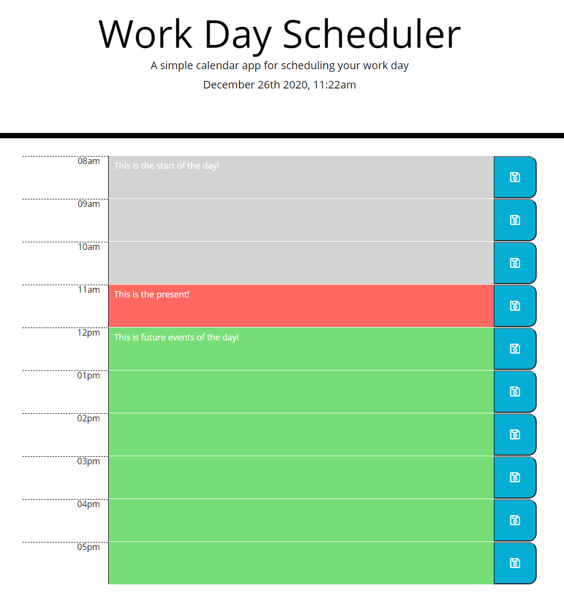
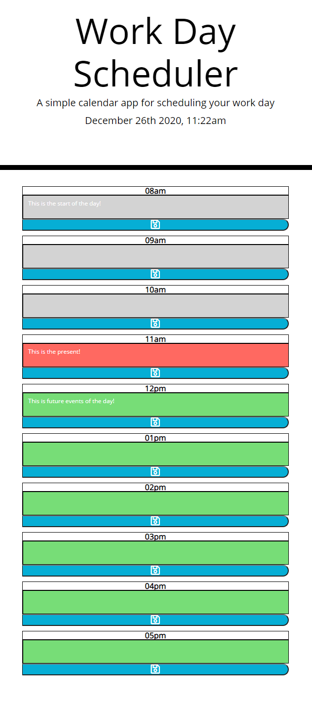

# day-planner
This is my project for the daily planner using jQuery and MomentJS. 

## Description

This application requires Javascript and jQuery to run properly. This is a calendar app where you can record your events for the day and better manage your time. The events for the hour is color coded so the events that have already past is in gray and the current events for the hour is orange. Future events are coded as green. 

You can contact me with any suggestions and improvements to the app. 

[Tony Tran](mailto:codemonkey713@gmail.com?subject=[GitHub]day-planner)

Here is a link to the deployed project. 

<https://code-monkey713.github.io/day-planner/>

## Installation

You can open the app on the browser to view the content. There are no special instructions for this application.  

## Usage

The app will open up with your current date and time. All the time slots will be blank for you to fill in for the day. Once you fill out for the time slot, click on the save button to save the event for that hour. 

The app is responsive so when you are using the app with a smaller screen size, the layout will change depending on the device size. 

Please follow the link to go to the calendar day planner app up above. Screenshots provided below for reference.

Screen size 768px or more screenshot  

Screen size less than 768px screenshot  

## Credits

I would like to give credit to my instructor Tish McNeel for helping me solve some issues with the responsive page layout. 

References:

https://momentjs.com/
https://api.jquery.com

## License

There is no license for this project. 
